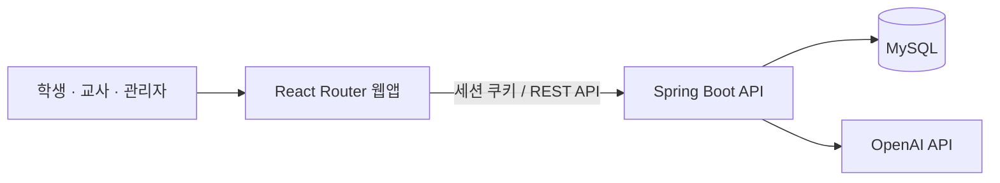

# J·E TRACE — 학습의 결과가 아니라 과정을 남기는 교육 기록 플랫폼

학생이 **AI와 무엇을 물었고, 어디서 막혔고, 무엇을 고쳐 썼는지**를 기록으로 남기고,
교사가 그 흐름을 보고 피드백하는 웹 서비스입니다.
제출물 한 장이 아니라 그 앞에 있었던 사고 과정을 평가 대상으로 삼자는 것이 출발점입니다.

- **구성**: `backend`(Spring Boot API) + `je-trace-frontend`(React Router 웹앱)
- **지금 상태**: 공개 배포는 중단했습니다. 로컬 실행으로 확인하거나, 로그인 화면의
  **역할별 미리보기**(개발 빌드 전용)로 화면만 둘러볼 수 있습니다.
- **최근 점검**: 2026-08-21 — 아래 [2026-08 점검](#2026-08-점검) 참고.
  항목별 근거는 [`BUG_FIX_PLAN.md`](BUG_FIX_PLAN.md) 에 29개 단계로 정리해뒀습니다.


---

## 2026-08 점검

저장소 전체를 다시 보고 고쳤습니다. 큰 것만 옮기면 이렇습니다.

| 무엇이 문제였나 | 어떻게 됐나 |
| --- | --- |
| 비밀번호가 **평문으로 저장**되고 README 에 관리자 계정(`admin` / `1234`)이 그대로 적혀 있었다 | BCrypt 해시 저장. 기존 평문 계정은 로그인 성공 시 그 자리에서 해시로 갱신. README 의 계정 정보 삭제 |
| 인증이 없었다. 프론트의 `localStorage` 역할 값만 믿고 API 가 응답했다 | HttpOnly 세션 쿠키로 발급·만료·로그아웃. 보호 API 는 `401`, 프론트는 401 을 받으면 로그인 화면으로 이동 |
| 요청 파라미터의 사용자 ID 를 바꾸면 **남의 데이터가 보였다** | 경로별 역할 검사(`/student` · `/teacher` · `/admin`) 후 세션의 사용자 ID 로 강제. 교사는 담당 반, 학생은 본인 리소스만 |
| 유지보수용 백필 API 가 교사 경로에 열려 있었다 | 관리자 전용 경로로 옮기고 기본 비활성(`MAINTENANCE_BACKFILL_ENABLED`), 실행 감사 로그 추가 |
| 오류 응답에 **예외 클래스와 원인 체인이 그대로** 실려 나갔다 | 공통 예외 처리기에서 400 · 401 · 403 · 404 · 500 으로 분류하고 내부 정보는 감춘다 |
| DB 스키마가 `DB.txt` 두 벌로 갈라져 있고 어느 쪽이 진짜인지 알 수 없었다 | DAO 기준으로 [`backend/schema.sql`](backend/schema.sql) 한 벌 작성. 구 스키마는 [`backend/legacy/`](backend/legacy/README.md) 로 분리 |
| 관리자 계정을 DB 스크립트에 평문으로 심어 만들었다 | `ADMIN_BOOTSTRAP_*` 환경변수로 최초 1회만 생성(기본 비활성). 기존 계정은 덮어쓰지 않는다 |
| 프론트에 API 주소가 없으면 요청이 **Vite 개발 서버로 날아갔다** | 개발 기본값 `http://localhost:8080`, 운영에서 미설정이면 요청을 막고 사유를 표시 |
| 비로그인 상태로 `/teacher` 에 들어가도 과제 API 를 호출했다 | 인증 확인 후 호출, 로그인 화면으로 한 번만 이동 |
| Windows 에서 `mvnw.cmd` 가 깨져 있어 **백엔드 테스트를 돌릴 수가 없었다** | Wrapper 수정. 전역 Maven 없이 `mvnw.cmd test` 가 돈다 |

### 아직 남은 것

- **학생 이름을 관계 키로 쓰는 구조**. `taskSubmission` · `taskAiLog` · `similarityResult` 등
  DAO 42곳이 `studentName` · `targetName` 으로 데이터를 잇습니다. 동명이인이나 개명 시 기록이 섞일 수 있습니다.
  한 번에 바꿀 수 없어서 사전 점검 SQL 과 단계별 전환 계획만 세워뒀습니다 —
  [`backend/STUDENT_IDENTITY_MIGRATION.md`](backend/STUDENT_IDENTITY_MIGRATION.md),
  [`backend/migrations/002_student_identity_preflight.sql`](backend/migrations/002_student_identity_preflight.sql).
  이름·반이 겹치는 계정이 하나라도 있으면 자동 백필이 기록을 영구히 섞기 때문에,
  점검 쿼리가 전부 빈 결과일 때만 전환합니다. 지금은 전환하지 않고 알고 감수하는 쪽입니다.

### 검증 상태

| 항목 | 결과 |
| --- | --- |
| 백엔드 테스트 | `mvnw.cmd test` 68개 통과 (H2 MySQL 호환 모드, OpenAI 키 불필요) |
| 프론트 타입 검사 · 프로덕션 빌드 | 통과 |
| E2E | Playwright 15개 시나리오 × 데스크톱 · 태블릿 · 모바일 = 45개 통과 |
| 의존성 | Axios 1.19.0 · React Router 7.18.2 로 올린 뒤 `npm audit` 0건 |
| **실제 MySQL 연동** | **미검증** — 로컬에 MySQL 이 없어 스키마는 구조 테스트로만 확인했습니다 |
| **실제 OpenAI 연동** | **미검증** — 테스트는 고정 응답 대역으로 돌렸습니다 |

---

## 핵심 기능

| 사용자 | 기능 |
| --- | --- |
| 학생 | 과제 확인·제출, AI 학습 대화, 마감 임박 과제, 사고 과정 진행 단계, 성찰 기록, 교사 피드백 확인과 수정 재제출, 주간 학습 변화, 내 기록 내보내기·삭제 요청 |
| 교사 | 과제 생성·관리, 반별 제출 현황, 학생별 진행 단계, AI 대화 로그 확인, 평가와 피드백, 답안 유사도 분석 |
| 관리자 | 교사 승인, 사용자 정보 변경 승인, 개인정보 삭제 요청 처리 |
| 공통 | 역할별 회원가입·로그인, 세션 인증, 개발 빌드 전용 역할별 미리보기 |

### 학생 대시보드에서 신경 쓴 것

성적이나 순위가 아니라 **다음에 뭘 하면 되는지**가 먼저 보이도록 짰습니다.

- **마감 임박 과제** — 7일 이내 최대 5개. 마감 시각 · 제출 상태 · 작성 진행률과 함께
  `이어서 기록하기` 로 해당 과제로 바로 이동합니다.
- **사고 과정 진행 단계** — `시작 전 → 첫 질문 → 추가 탐색 → 풀이 작성 → 제출` 을
  실제 질문·풀이·제출 기록으로 계산합니다. 열람 이벤트가 DB 에 없어서
  `과제 확인` 은 추측하지 않고 `시작 전` 으로 둡니다.
- **오늘의 성찰** — 처음 생각과 달라진 점, AI 답변 중 직접 확인한 것, 아직 모르는 것,
  다시 푼다면 어떻게 할지 + 이해도 1~5. 임시 저장과 최종 저장을 나눴습니다.
- **피드백 수신함** — 읽지 않은 개수, 검토 완료 · 수정 요청 · 수정 제출 상태 구분,
  피드백 전후 답안 비교.
- **주간 학습 변화** — 질문 수 · 풀이 수정 횟수 · 성찰 수 · 피드백 반영률을
  지난주와 비교해 문장으로 알려줍니다. 점수와 순위는 쓰지 않습니다.
- **AI 기록 투명성** — 학생이 쓴 것과 AI 가 쓴 것을 화면에서 구분하고, 교사에게 공개되는
  범위와 저장되는 개인정보를 안내합니다. 민감정보 입력 전에는 경고를 띄웁니다.
  본인 기록 JSON 내보내기와 삭제 요청 → 관리자 승인 흐름이 있습니다
  ([`PRIVACY_POLICY.md`](PRIVACY_POLICY.md)).

---

## 화면

아래 캡처는 로그인 없이 볼 수 있는 **미리보기 모드**라 수치가 비어 있습니다.

| 로그인 | 교사 과제 관리 |
| --- | --- |
|  |  |

---

## 기술 스택

| 영역 | 기술 |
| --- | --- |
| Frontend | React 19 · TypeScript 5 · React Router 7 · Tailwind CSS 4 · Vite 8 · TipTap · Axios |
| Backend | Java 17 · Spring Boot 4 · MyBatis · Maven Wrapper · Spring Security Crypto(BCrypt) |
| Database | MySQL 8 (테스트는 H2 MySQL 호환 모드) |
| AI | OpenAI API — 학습 대화와 유사도 분석 |
| Test | JUnit · Spring Boot Test · Playwright |



인증은 HttpOnly 세션 쿠키를 쓰기 때문에 프론트 요청은 전부 `withCredentials: true` 입니다.

---

## 실행 방법

준비물은 Java 17 · Node.js 20+ · MySQL 8 이고, AI 대화와 유사도 분석을 쓰려면 OpenAI API 키가 필요합니다.

```sql
CREATE DATABASE jetrace CHARACTER SET utf8mb4 COLLATE utf8mb4_unicode_ci;
```

`backend/schema.sql` 을 실행합니다. 이미 운영하던 DB 라면 `backend/migrations` 의 SQL 을
번호순으로 적용합니다. 새 DB 는 스키마 파일 하나로 시작할 수 있습니다.

```powershell
# 백엔드
cd backend
Copy-Item .env.example .env      # DB 접속 정보와 OPENAI_API_KEY 입력
./mvnw.cmd spring-boot:run       # http://localhost:8080

# 프론트엔드
cd je-trace-frontend
Copy-Item .env.example .env      # VITE_API_BASE_URL
npm install
npm run dev
```

`.env` 를 환경변수로 올리는 방법을 포함한 자세한 순서는
[원본 저장소 README](https://github.com/snail5039-code/J-E-Trace) 에 있습니다.

**화면만 빠르게 보고 싶다면** 로그인 페이지의 *로그인 없이 학생/교사/관리자 화면 미리보기* 를
쓰면 됩니다. 개발 빌드에서만 노출되고(`import.meta.env.DEV`), 실제 학습 데이터는 나오지 않습니다.

### 테스트

```powershell
cd backend
./mvnw.cmd test

cd ../je-trace-frontend
npm run typecheck
npm run build
npm run test:e2e        # 로컬 서버 필요
```

---

## 프로젝트 구조

```text
J-E-Trace/
├─ backend/                        # Spring Boot API
│  ├─ schema.sql                   # 현재 코드 기준 단일 스키마
│  ├─ migrations/                  # 운영 DB 증분 적용 SQL
│  ├─ legacy/                      # 더 이상 쓰지 않는 구 스키마
│  └─ STUDENT_IDENTITY_MIGRATION.md
├─ je-trace-frontend/              # React Router 웹앱 + Playwright E2E
├─ docs/screenshots/               # README 용 화면 캡처
├─ PRIVACY_POLICY.md               # 개인정보 처리방침
└─ BUG_FIX_PLAN.md                 # 점검·수정 29단계 기록
```

---

## 원본 저장소와의 차이

이 폴더는 [snail5039-code/J-E-Trace](https://github.com/snail5039-code/J-E-Trace) 의
포트폴리오용 스냅샷입니다. 원본 최신 커밋 `fc3974a`(2026-08-21, `test` 브랜치) 기준이고
파일 구성은 같습니다. 비밀값은 없습니다.

한 가지 이력만 남겨둡니다. 초안 커밋부터 Eclipse 워크스페이스 상태 폴더
`.metadata/`(파일 165개)가 원본에 함께 올라가 있었습니다. 소스가 아니라 에디터 로컬
상태이고 안에 SWT 브라우저(WebView2) 프로필까지 들어 있어서, 원본에서 `.gitignore` 에
다시 넣고 추적을 끊었습니다(`fc3974a`). 저장된 자격증명은 없었고 브라우저 기록도 임시
파일 1건뿐이라 유출된 값은 없습니다. 다만 **과거 커밋에는 그대로 남아 있습니다.**
