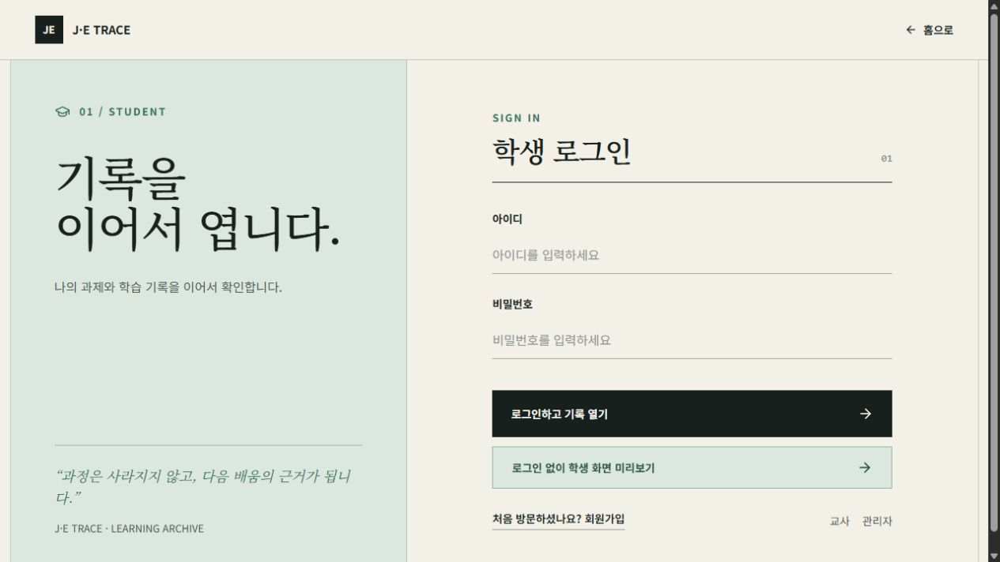
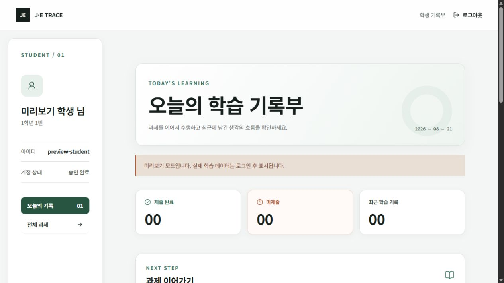
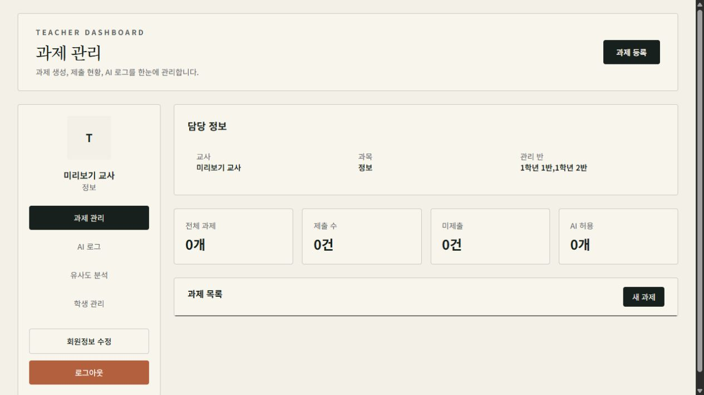

# 박의혁

**Backend & AI Agent Developer**

> 아이디어부터 구현, 자동화, 배포까지 혼자 끝까지 붙잡고 갑니다.

사용자에게 실제로 닿는 웹·모바일 서비스와 AI Agent 워크플로우를 만듭니다.
만들어 놓고 끝내지 않고, 시간이 지나면 저장소를 다시 열어 안 되는 부분을 찾아 고칩니다.
각 프로젝트 README 아래쪽에는 무엇이 아직 안 되는지도 같이 적어뒀습니다.

---

## Featured Projects

<table>
<tr>
<td width="50%" valign="top">

### 🔨 [HyukForge](./hyukforge)

**배포 중** · Next.js 16 · Supabase · next-intl

혼자 만든 제품을 한곳에 모아 배포하는 1인 소프트웨어 스튜디오 사이트입니다.
제품·릴리스·공지·개발 기록을 관리자 페이지에서 등록하면 재배포 없이 사이트에 반영되고,
설치 파일은 GitHub Releases 에서 로그인한 사용자에게 내려갑니다. 화면 문구는 10개 언어.

[hyukforge.vercel.app](https://hyukforge.vercel.app) · [코드](./hyukforge)

</td>
<td width="50%" valign="top">

### 🚇 [출퇴근 생존일지](./commute-battle)

**배포 중** · Next.js 16 · Supabase · Gemini · Electron

출퇴근 기록을 회사 기준(소정근로·휴게·연장·야간·휴일근로)으로 계산하고,
정정·휴가·재택을 부서장이 승인하며, 월 마감으로 급여 지급 근거를 확정하는 근태 관리 시스템입니다.
임금에 영향을 주는 계산은 전부 PostgreSQL 함수 안에 있어서, 브라우저를 조작해도 숫자가 바뀌지 않습니다.
그래서 회귀 테스트도 SQL 로 216개 썼습니다.

[commute-battle.vercel.app](https://commute-battle.vercel.app) · [코드](./commute-battle)

</td>
</tr>
<tr>
<td width="50%" valign="top">

### 🎓 [J·E TRACE](./J-E-Trace)

**로컬 실행** · React Router 7 · Spring Boot 4 · MySQL · OpenAI

학생이 AI 와 무엇을 묻고 어디서 막혔는지를 기록으로 남기고, 교사가 그 흐름을 보며 피드백합니다.
제출물 한 장이 아니라 그 앞에 있었던 사고 과정을 평가 대상으로 삼자는 것이 출발점이었습니다.
8월에 저장소를 다시 훑어 평문 비밀번호와 무인증 API 를 포함해 29단계를 고쳤고,
백엔드 테스트 68개와 E2E 45개를 새로 붙였습니다.

[코드](./J-E-Trace) · [점검 내역](./J-E-Trace/BUG_FIX_PLAN.md)

</td>
<td width="50%" valign="top">

### ✋ [GestureOSManager](./GestureOS)

**로컬 실행** · MediaPipe · OpenCV · Spring Boot 3 · Electron

카메라로 손 제스처를 인식해 Windows 마우스·키보드·PPT·그리기를 제어하는 대체 입력 시스템입니다.
원래 목표는 수어 번역이었는데 연속 동작에서 인식이 흔들려 OS 제어 쪽으로 방향을 틀었습니다.
잘 안 잡히는 제스처는 사용자가 본인 손으로 직접 학습시킬 수 있습니다.

[코드](./GestureOS) · [점검 내역](./GestureOS/PROJECT_STATUS.md)

</td>
</tr>
<tr>
<td width="50%" valign="top">

### 🚑 [LastCall](./lastcall)

**릴리스** · React Native · Expo SDK 54 · Spring Boot · MySQL

현재 위치와 진료 조건으로 주변 응급실을 찾고, 응급 상황에서 뭘 해야 하는지 알려주는 모바일 앱입니다.
공공데이터 API 로 병원 정보를 받아옵니다. 안드로이드 릴리스까지 냈고 스토어 출시는 하지 않았습니다.

[Android v1.0.0-rc4](https://github.com/snail5039-code/lastcall/releases/tag/v1.0.0-rc4) · [코드](./lastcall)

</td>
<td width="50%" valign="top">

### 🍽️ [나만의 작은 맛집](./my-little-restaurant)

**배포 중** · Next.js 16 · React 19 · Supabase · Gemini

가본 맛집을 저장하고 리뷰를 남기는 웹 서비스입니다.
소셜 로그인으로 들어가 개인 취향대로 목록을 관리합니다.

[my-little-restaurant.vercel.app](https://my-little-restaurant.vercel.app) · [코드](./my-little-restaurant)

</td>
</tr>
</table>

### 화면

저장소에 캡처를 넣어둔 건 J·E TRACE 뿐입니다. 배포된 서비스는 위 주소에서 바로 볼 수 있습니다.

<table>
<tr>
<td width="33%"></td>
<td width="33%"></td>
<td width="33%"></td>
</tr>
<tr>
<td align="center">로그인</td>
<td align="center">학생 기록부</td>
<td align="center">교사 과제 관리</td>
</tr>
</table>

---

## Projects

| 분야 | 프로젝트 | 한 줄 소개 | 주요 기술 | 상태 |
| :--: | --- | --- | --- | :--: |
| 🔨 | [HyukForge](./hyukforge) | 직접 만든 제품을 배포하는 1인 스튜디오 사이트 | Next.js 16, Supabase, next-intl | **배포** |
| 🚇 | [출퇴근 생존일지](./commute-battle) | 근무시간 산정·승인 라인·월 마감을 갖춘 근태 관리 시스템 | Next.js 16, Supabase, Gemini, Electron | **배포** |
| 🍽️ | [나만의 작은 맛집](./my-little-restaurant) | 맛집 저장·리뷰와 소셜 로그인을 제공하는 웹 앱 | Next.js 16, React 19, Supabase, Gemini | **배포** |
| 📱 | [LastCall](./lastcall) | 위치 기반 응급실 탐색 모바일 서비스 | Expo, Spring Boot, MySQL | 미출시 (릴리스 완료) |
| 🎓 | [J·E TRACE](./J-E-Trace) | AI 대화·성찰·피드백까지 학습 과정을 남기는 교육 기록 플랫폼 | React Router 7, Spring Boot 4, MySQL, OpenAI | 구현 (배포 중단) |
| 🖐️ | [GestureOSManager](./GestureOS) | 손 제스처 인식 기반 Windows 입력·OS 제어 시스템 | MediaPipe, OpenCV, Spring Boot, Electron | 구현 |
| 📝 | [WorkLog](./WorkLog_project) | 업무일지를 요약해 DOCX 양식으로 뽑는 업무 기록 시스템 | Spring Boot 3, MyBatis, React 19, MySQL | 구현 |
| 🤖 | [고객 VOC 분석 Agent](./고객_VOC_분석_Agent) | 고객 문의 분류, 감정 분석과 긴급 알림 자동화 | n8n, Gemini, Google Sheets | 구현 |
| 📰 | [금융 뉴스 브리핑 Agent](./금융_뉴스_브리핑_Agent) | 금융 뉴스 수집·중복 제거·요약·발송 자동화 | n8n, RSS, Gemini, Discord | 구현 |
| 🔮 | [과제 미루기 사주 / AI 사주보기](./사주챗봇) | 재미로 보는 사주와 과제 운세 웹 앱 | Flask, Python, Gemini | 구현 |

기획 문서와 워크플로우 아이디어 5건

 

| 프로젝트 | 내용 | 단계 |
| --- | --- | :--: |
| [n8n 날씨운세봇](./n8n_날씨운세봇) | 매일 아침 날씨와 개인화 운세를 Discord 로 발송 | 기획 |
| [n8n API 가이드봇](./n8n_API가이드봇) | Public API 를 찾아 추천하고 실행 결과까지 전달 | 기획 |
| [캘린더 회고봇](./캘린더회고봇) | Google Calendar 기반 주간 회고 리포트 생성 | 기획 |
| [출퇴근 생존일지 초기 기획](./출퇴근전쟁봇) | 웹 서비스로 발전하기 전의 Telegram Bot 기획 | 발전 완료 |
| [최종 프로젝트 아이디어](./최종프로젝트_아이디어) | 미니 프로젝트 경험을 종합한 서비스 아이디어 노트 | 아이디어 |

---

## Tech Stack

<table>
<tr>
<td width="140"><b>Backend</b></td>
<td>

</td>
</tr>
<tr>
<td><b>Frontend</b></td>
<td>

</td>
</tr>
<tr>
<td><b>Mobile · Desktop</b></td>
<td>

</td>
</tr>
<tr>
<td><b>AI · Vision</b></td>
<td>

</td>
</tr>
<tr>
<td><b>Data · Infra</b></td>
<td>

</td>
</tr>
<tr>
<td><b>Test · Automation</b></td>
<td>

</td>
</tr>
</table>

---

## Repository Guide

각 프로젝트 폴더에는 기능, 실행 방법, 기술적 의사결정과 트러블슈팅을 정리한 별도 README 가 있습니다.
커밋 규칙은 [COMMIT_CONVENTION.md](./COMMIT_CONVENTION.md) 에 있습니다.

> 일부 프로젝트는 별도 저장소에서 개발한 결과물을 포트폴리오용으로 정리한 스냅샷이며,
> API 키와 환경 변수는 포함하지 않습니다. 원본과 다른 점이 있으면 각 README 아래쪽에 적어뒀습니다.

---

### Contact

[GitHub](https://github.com/snail5039-code) · [snail5039@gmail.com](mailto:snail5039@gmail.com)

