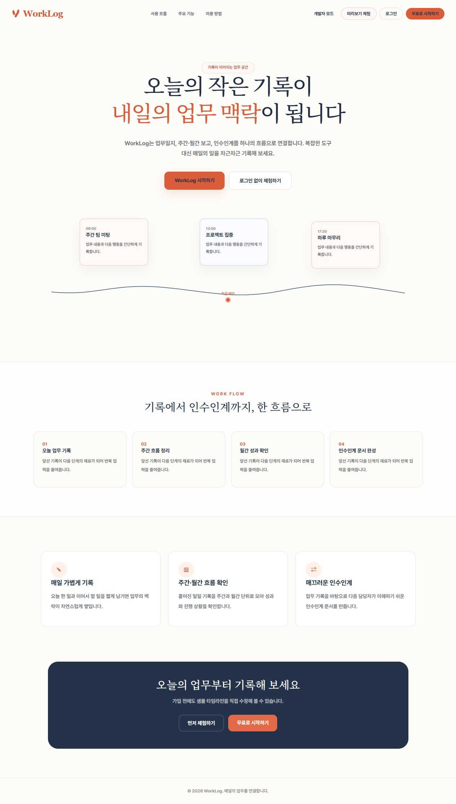
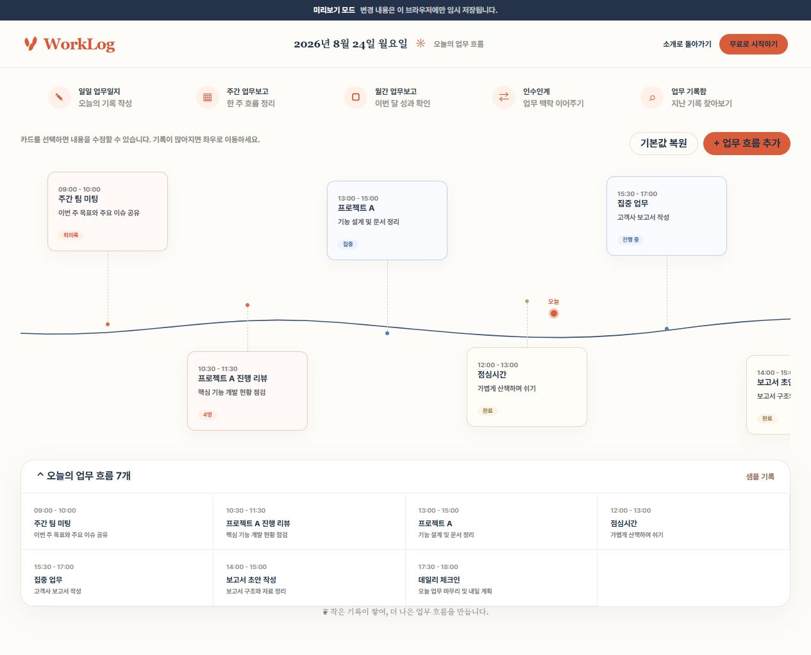
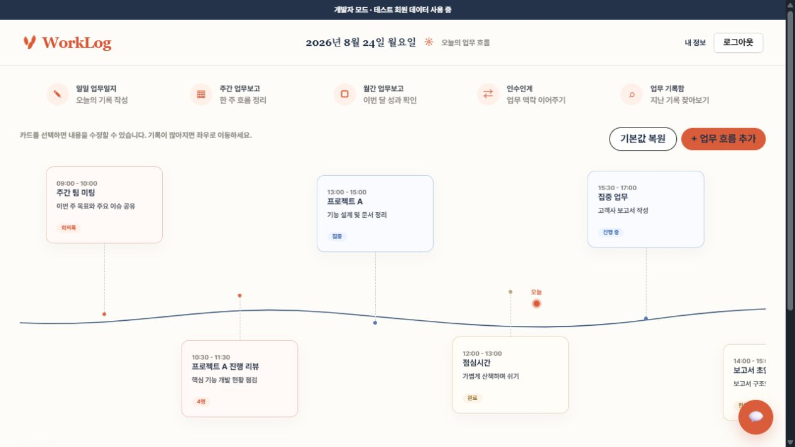
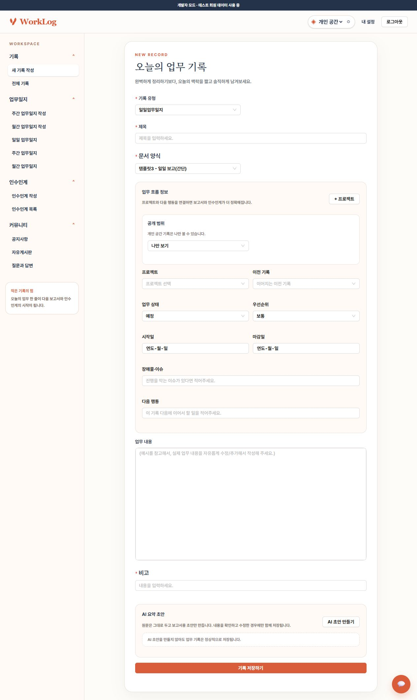
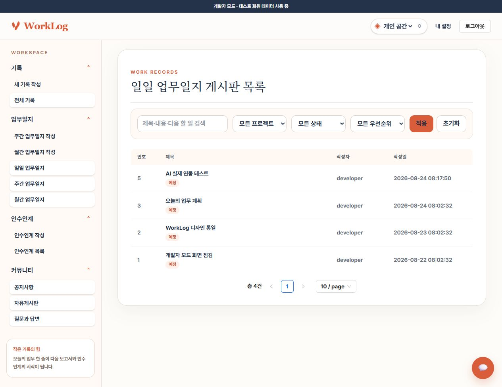
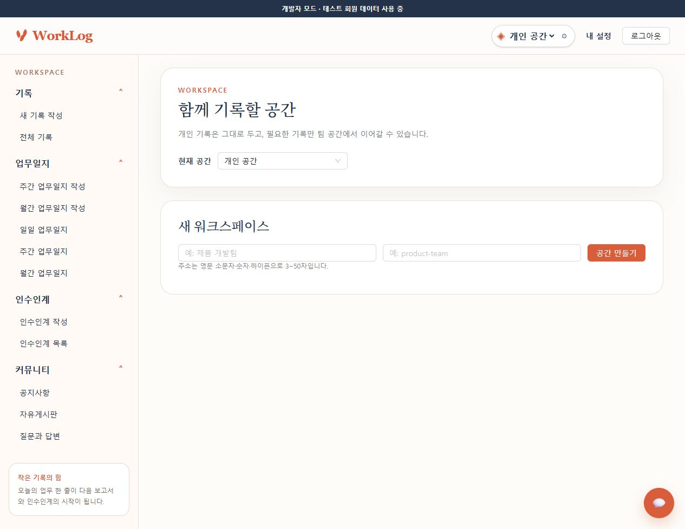
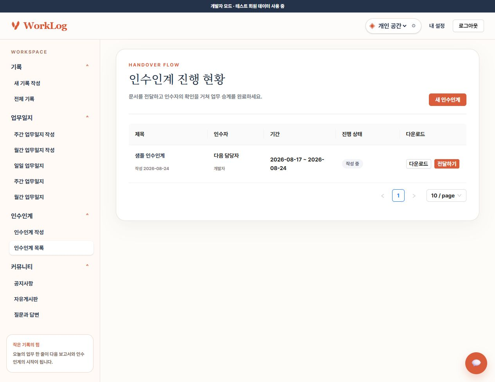

# WorkLog

매일의 업무 기록을 주간·월간 보고와 인수인계까지 연결하는 업무 기록 서비스입니다. AI가 원문을 대신 쓰는 도구가 아니라, 사용자가 남긴 기록을 정리하고 문서로 전환하는 보조 도구를 지향합니다.

> 현재 상태: 로컬 개발 환경에서 주요 사용자 흐름과 실제 OpenAI API 연동 검증 완료 · 배포 전 단계



## 왜 만들었나요?

업무가 끝난 뒤 업무일지와 주간 보고를 다시 작성하면서 같은 내용을 반복 입력하는 문제에서 시작했습니다. WorkLog에서는 오늘의 짧은 기록이 다음 보고서와 인수인계의 재료가 됩니다.

```text
일일 기록 → 주간 요약 → 월간 성과 → 인수인계 문서
```

## 주요 기능

| 영역 | 기능 |
| --- | --- |
| 일일 업무 | 제목·본문·상태·우선순위·기간·다음 행동·프로젝트 기록 |
| AI 보조 | 저장 전 요약 미리보기, 사용자 편집, 편집본만 확정 저장 |
| 주간·월간 보고 | 선택 기간의 일일 기록을 모아 AI 요약 및 게시글 등록 |
| 인수인계 | 기간별 업무를 AI가 인수인계 구조로 정리하고 DOCX로 출력 |
| 기록 관리 | 검색, 프로젝트·상태·우선순위 필터, 상세·수정·삭제 |
| 협업 기반 | 개인/워크스페이스 전환, 팀 생성, 이메일 초대, 역할 관리 |
| 공개 범위 | 나만 보기, 워크스페이스 전체, 선택한 팀 |
| 커뮤니티 | 공지사항, 자유게시판, 질문과 답변, 댓글·첨부파일 |

## 화면

### 로그인 없이 확인하는 미리보기

가입 전에도 샘플 업무 카드를 수정하고 업무 흐름 UI를 체험할 수 있습니다.



### 오늘의 업무 흐름

로그인 후 첫 화면에서는 하루 일정을 시간 흐름으로 확인하고 카드를 직접 추가·수정할 수 있습니다.



### 업무 기록과 AI 초안

원문, 업무 상태, 우선순위, 프로젝트와 다음 행동을 기록합니다. AI 초안은 선택 기능이며 생성 후 편집하거나 제외할 수 있습니다.



### 기록함

누적된 기록을 키워드와 구조화 필드로 검색하고 이전 업무의 맥락을 다시 찾습니다.



### 워크스페이스와 팀

개인 공간과 협업 공간을 분리하고, 워크스페이스 안에서 팀·멤버·역할을 관리합니다.



### 인수인계

선택한 기간의 일일 기록을 인수인계용 문장으로 정리해 저장하고 DOCX로 내려받습니다.



## 워크스페이스 사용 방법

1. 내부 화면 상단의 `개인 공간` 선택 메뉴 옆 `⚙`을 누릅니다.
2. 워크스페이스 이름과 주소를 입력해 공간을 만듭니다.
3. 필요한 경우 팀을 만들고 이메일 초대 링크를 발급합니다.
4. 상단 선택 메뉴에서 사용할 워크스페이스를 고릅니다.
5. 업무 기록 작성 시 공개 범위를 정합니다.

| 역할 | 주요 권한 |
| --- | --- |
| 소유자 | 워크스페이스 전체 관리 |
| 관리자 | 멤버 초대와 역할 변경, 팀 생성 |
| 매니저 | 팀 생성과 일반 협업 기능 |
| 구성원 | 소속 공간과 팀의 일반 기능 사용 |

현재 워크스페이스·팀 생성과 기록의 소속/공개 범위 저장까지 연결되어 있습니다. 팀별 전용 대시보드와 공유 기록을 모아 보는 화면은 다음 확장 범위입니다.

## AI 처리 원칙

- 사용자의 업무 원문은 AI 요약과 분리해 보존합니다.
- AI는 저장 전에 미리보기로 보여주며 사용자가 수정할 수 있습니다.
- 원문이 바뀌면 기존 AI 초안을 자동 제외해 내용 불일치를 방지합니다.
- AI 호출을 건너뛰거나 실패해도 원문 기록은 저장할 수 있습니다.
- 주간·월간·인수인계는 각각 목적에 맞는 별도 프롬프트를 사용합니다.

## 기술 구성

| 구분 | 기술 |
| --- | --- |
| Frontend | React 19, Vite, React Router, Ant Design, Tailwind CSS |
| Backend | Java 17, Spring Boot 3, Spring AI, MyBatis |
| Database | MySQL |
| Document | Apache POI, PDFBox, HWPLib |
| AI | OpenAI API via Spring AI |
| Auth | 서버 세션, Firebase 소셜 로그인 |

```text
React :5173
   │ credentials: include
   ▼
Spring Boot :8081 ── MySQL
   ├─ OpenAI API
   ├─ SMTP / Firebase
   └─ uploads / DOCX templates
```

## 프로젝트 구조

```text
WorkLog_project/
├─ WorkLog_project_React/   # React 프런트엔드
├─ WorkLog_project_Spring/  # Spring Boot API와 문서 생성
├─ docs/
│  ├─ screenshots/         # README 실행 화면
│  ├─ FIX_PLAN.md
│  ├─ PRODUCT_IMPROVEMENT_ROADMAP.md
│  └─ TEAM_PERMISSION_DATA_MODEL_V1.md
└─ README.md
```

## 로컬 실행

### 1. 필요 환경

- Java 17
- Node.js와 npm
- MySQL 8.x 또는 호환 서버
- OpenAI API 키: AI 기능을 실제로 확인할 때만 필요

### 2. 데이터베이스

```sql
CREATE DATABASE workLog_project CHARACTER SET utf8mb4 COLLATE utf8mb4_unicode_ci;
```

개발용 스키마와 샘플 데이터는 `WorkLog_project_Spring/src/main/resources/db/developer-schema.sql`에 있습니다.

### 3. 백엔드 환경변수

`WorkLog_project_Spring/.env.example`을 `.env`로 복사합니다.

```properties
OPENAI_API_KEY=sk-your-openai-api-key
SPRING_MAIL_HOST=localhost
WORKLOG_DEVELOPER_MODE_ENABLED=false
WORKLOG_DEVELOPER_MEMBER_ID=1
```

실제 키가 들어간 `.env`는 Git에 커밋하지 않습니다. 로그인 없이 내부 기능을 확인할 로컬 환경에서만 `WORKLOG_DEVELOPER_MODE_ENABLED=true`로 바꿉니다.

### 4. 서버 실행

```bash
cd WorkLog_project_Spring
./mvnw spring-boot:run
```

Windows PowerShell:

```powershell
cd WorkLog_project_Spring
.\mvnw.cmd spring-boot:run
```

### 5. 프런트엔드 실행

```bash
cd WorkLog_project_React
npm install
npm run dev -- --host 127.0.0.1 --port 5173
```

- 서비스: `http://127.0.0.1:5173`
- 개발자 모드: `http://127.0.0.1:5173/developer`
- 백엔드 API: `http://127.0.0.1:8081`

## 개발자 모드

개발자 모드는 로컬에서 로그인 절차를 생략하고 설정된 테스트 회원의 실제 백엔드 세션을 발급합니다. 단순 정적 미리보기가 아니라 작성·목록·AI·인수인계·워크스페이스 API를 그대로 사용합니다.

1. MySQL과 백엔드를 실행합니다.
2. `.env`에서 `WORKLOG_DEVELOPER_MODE_ENABLED=true`를 설정합니다.
3. 백엔드를 재시작합니다.
4. `/developer`에서 `개발자 모드 시작`을 누릅니다.

운영 환경에서는 인증 우회를 막기 위해 반드시 `false`로 유지해야 합니다.

## 검증

```powershell
cd WorkLog_project_Spring
.\mvnw.cmd test

cd ..\WorkLog_project_React
npm run lint
npm run build
```

2026-08-24 기준:

- Spring 테스트 39개 통과
- React ESLint 및 Vite 프로덕션 빌드 통과
- 실제 OpenAI API로 일일 요약 생성·편집·저장 확인
- 실제 OpenAI API로 주간·월간 요약 확인
- 실제 OpenAI API로 인수인계 생성·DOCX 다운로드 확인
- 워크스페이스 생성·팀 선택·역할별 API 권한 확인

빌드에는 CSS `@property` 호환성과 큰 번들에 대한 비차단 경고가 남아 있습니다. 배포 최적화 단계에서 라우트 단위 코드 분할을 적용할 예정입니다.

## 관련 문서

- [전체 점검과 수정 계획](docs/FIX_PLAN.md)
- [제품 개선 로드맵](docs/PRODUCT_IMPROVEMENT_ROADMAP.md)
- [업무 기록 데이터 모델](docs/WORK_RECORD_DATA_MODEL_V1.md)
- [팀·권한 데이터 모델](docs/TEAM_PERMISSION_DATA_MODEL_V1.md)

## 보안 주의사항

- `.env`, OpenAI 키, Firebase 서비스 계정 파일은 커밋하지 않습니다.
- 개발자 모드는 운영 환경에서 활성화하지 않습니다.
- 인증은 서버 세션을 기준으로 하며 프런트 요청은 쿠키를 포함합니다.

---

작은 기록이 쌓여 더 나은 업무 흐름을 만듭니다.
