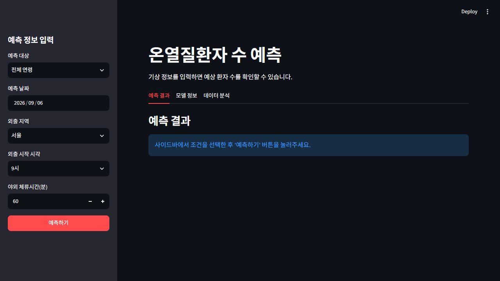
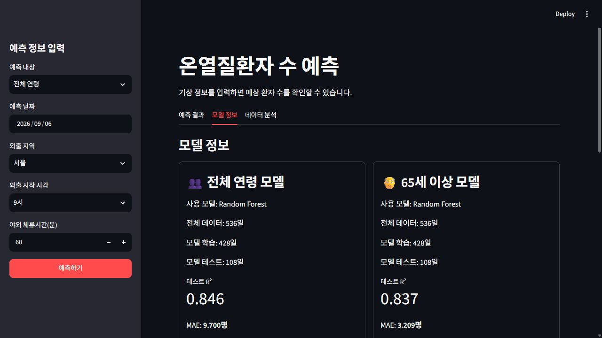
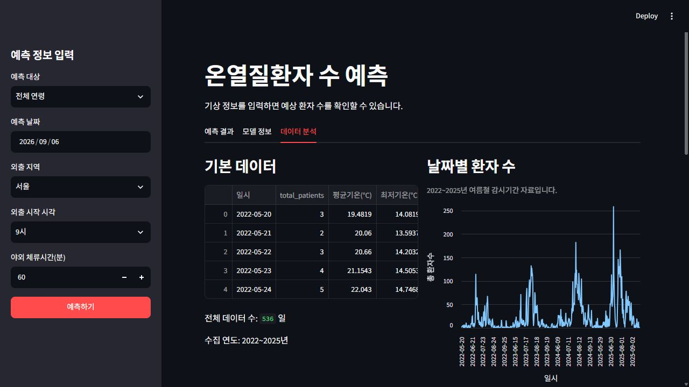
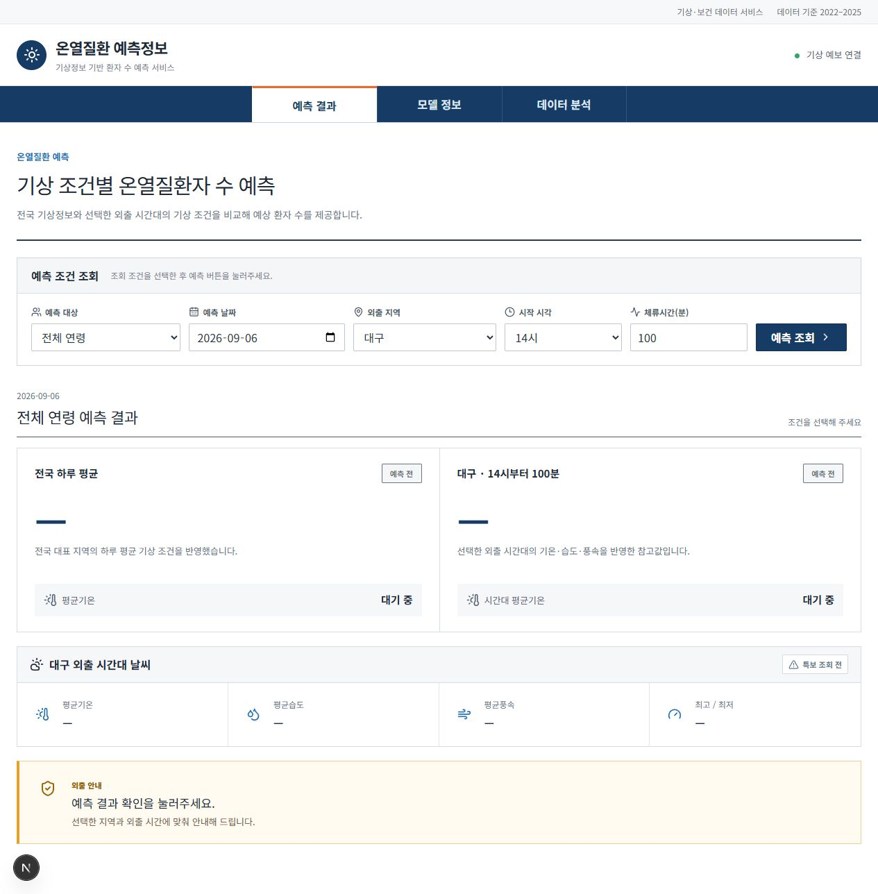
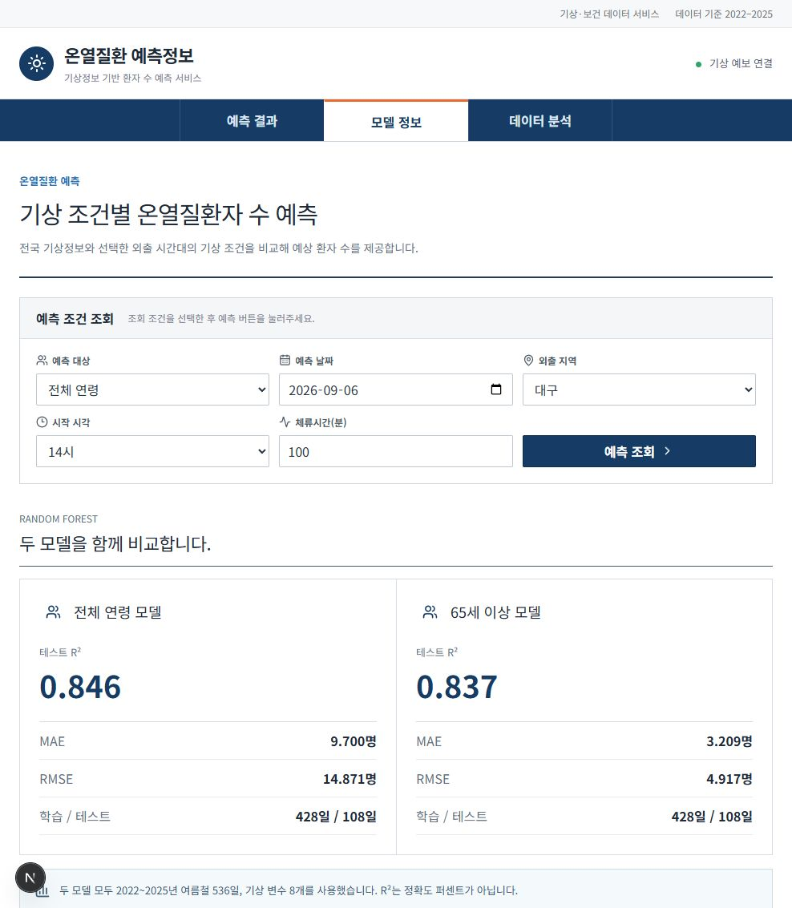
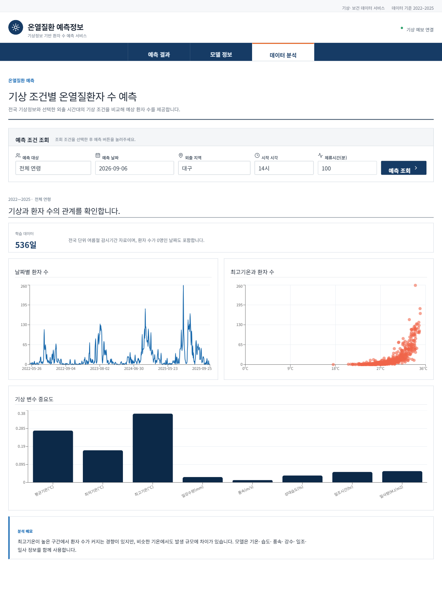

# 기상 조건 기반 온열질환자 수 예측

2022~2025년 기상 자료와 질병관리청 온열질환 신고 자료를 바탕으로 **전국 일일 온열질환자 수**를 예측하는 프로젝트입니다.
전체 연령과 65세 이상 대상을 각각 별도의 Random Forest 모델로 관리하며, 같은 예측·분석 기능을 Streamlit 앱과 Next.js 웹사이트 두 가지 화면으로 제공합니다.

> 예측값은 전국 단위의 하루 예상 신고 환자 수입니다. 특정 지역의 실제 환자 수, 개인의 발병 확률 또는 외출 안전 판정을 의미하지 않습니다.

## 배포 주소

- Streamlit 앱: https://heatwave-risk-ml-twwshgp6evhagezahawdeq.streamlit.app/
- Next.js 웹사이트: https://web-wine-one-11.vercel.app/

## 주요 기능

- 전체 연령 / 65세 이상 예측 모델 선택
- 전국 하루 평균 기상정보 기반 예상 환자 수 제공
- 선택 지역과 외출 시간대의 기상 조건 기반 참고 예측
- 기온·습도·풍속·강수량과 폭염특보 확인
- 모델 성능 및 입력 변수 비교
- 날짜별 환자 수, 최고기온과 환자 수 관계, 변수 중요도 시각화

## 화면 구성

### 1. Streamlit 앱

Python만으로 실행하는 분석형 대시보드입니다. 사이드바에서 예측 조건을 입력하고 `예측 결과`, `모델 정보`, `데이터 분석` 탭을 확인할 수 있습니다.

배포 주소: https://heatwave-risk-ml-twwshgp6evhagezahawdeq.streamlit.app/

#### 예측 결과



#### 모델 정보



#### 데이터 분석



### 2. Next.js 웹사이트

기존 Python 모델과 데이터, 기상 API 로직을 TypeScript로 이식한 별도 웹 대시보드입니다. 요청마다 Python을 실행하지 않아 Vercel 같은 서버리스 환경에도 배포할 수 있습니다. 데스크톱과 모바일 화면에 대응하는 반응형 UI를 제공합니다.

배포 주소: https://web-wine-one-11.vercel.app/

#### 예측 결과



#### 모델 정보



#### 데이터 분석



## 모델과 데이터

| 대상 | 학습 데이터 | 저장 모델 | 테스트 R² | MAE | RMSE |
| --- | --- | --- | ---: | ---: | ---: |
| 전체 연령 | `data/processed/train_dataset.csv` | `model/saved/heat_patient_model.pkl` | 0.846 | 9.700명 | 14.871명 |
| 65세 이상 | `data/processed/train_dataset_elderly65_2022_2025.csv` | `model/saved/heat_patient_elderly65_model.pkl` | 0.837 | 3.209명 | 4.917명 |

두 학습 데이터는 각각 536일이며 다음 8개 기상 변수를 사용합니다.

- 평균기온, 최저기온, 최고기온
- 일강수량, 평균 풍속, 평균 상대습도
- 합계 일조시간, 합계 일사량

테스트 결과는 데이터를 무작위로 80:20 분리해 평가한 값입니다. R²는 정확도 퍼센트가 아닙니다.

## 실행 준비

검증 환경은 Python 3.13과 Node.js 기반입니다. 프로젝트 루트에서 Python 가상환경과 의존성을 준비합니다.

```powershell
python -m venv .venv
.\.venv\Scripts\Activate.ps1
python -m pip install -r requirements.txt
```

실시간 예측은 Open-Meteo 기상 예보를 사용합니다. 기상청 폭염특보까지 조회하려면 예시 파일을 복사하고 API 키를 입력합니다.

```powershell
Copy-Item .streamlit\secrets.toml.example .streamlit\secrets.toml
```

```toml
KMA_API_KEY = "발급받은_기상청_API_키"
```

API 키가 없어도 앱과 분석 화면은 실행할 수 있지만 기상청 폭염특보는 조회되지 않습니다.

## Streamlit 실행

프로젝트 루트에서 실행합니다.

```powershell
.\.venv\Scripts\python.exe -m streamlit run app.py
```

브라우저에서 [http://localhost:8501](http://localhost:8501)을 엽니다.

## Next.js 웹사이트 실행

`web` 폴더에서 실행합니다. Python 가상환경 없이도 동작합니다.

```powershell
cd web
npm install
npm run dev
```

브라우저에서 [http://localhost:3000](http://localhost:3000)을 엽니다.

운영 빌드는 다음 명령으로 확인할 수 있습니다.

```powershell
npm run build
npm start
```

모델과 학습 데이터는 `web/src/data`에 정적 JSON으로 내보내 두었고, 기상 API 로직은 `web/src/lib`에 TypeScript로 이식했습니다. 모델이나 학습 데이터를 다시 만들었다면 아래 명령으로 JSON을 갱신해야 합니다 (프로젝트 루트 `.venv` 필요).

```powershell
.\.venv\Scripts\python.exe web\scripts\export_static_data.py
```

## 프로젝트 구조

```text
analysis/                   EDA 코드
data/
  raw/                      연도별 원본 자료
  processed/                일별 집계 및 학습 데이터
docs/
  screenshots/              Streamlit·Next.js 화면 이미지
  기획/                     초기 기획 문서
  분석보고서/               통합·모델별 보고서와 그래프
  화면설계/                 Streamlit 화면 시안
model/
  saved/                    전체 연령·65세 이상 저장 모델
  risk_level.py             예측 등급과 외출 안내
steps/                      단계별 학습 안내
web/                        Next.js 웹사이트
app.py                      Streamlit 앱
weather_api.py              기상 예보·폭염특보 연동
requirements.txt            Python 의존성
plan.md                     전체 계획
HANDOFF.md                  인수인계 기록
```

## 보고서

- [통합 분석 보고서](docs/분석보고서/00_통합_분석보고서.pdf)
- [분석 그래프 안내](docs/분석보고서/README.md)

## 데이터 해석 및 출처

고령자 공개 원본과 공식 연보는 2022~2024년 합계가 다르며 원인은 확인되지 않았습니다. 신고 기록을 임의로 삭제하거나 합계를 조정하지 않았습니다.

- 질병관리청 온열질환 응급실감시체계
- 기상청 ASOS 일자료
- [공공데이터포털 고령자 원본](https://www.data.go.kr/data/15149889/fileData.do)

학습 스크립트는 실행 시 모델을 재학습하거나 저장 모델을 덮어쓸 수 있으므로 필요한 경우에만 실행하세요.
