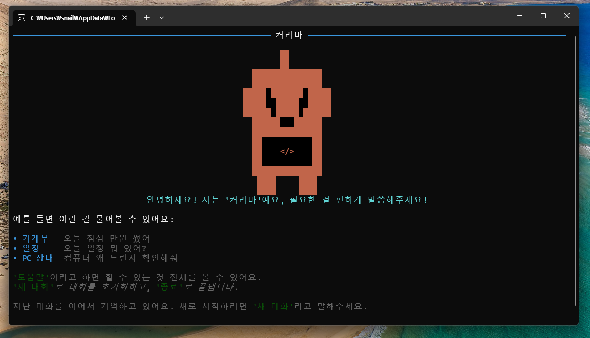
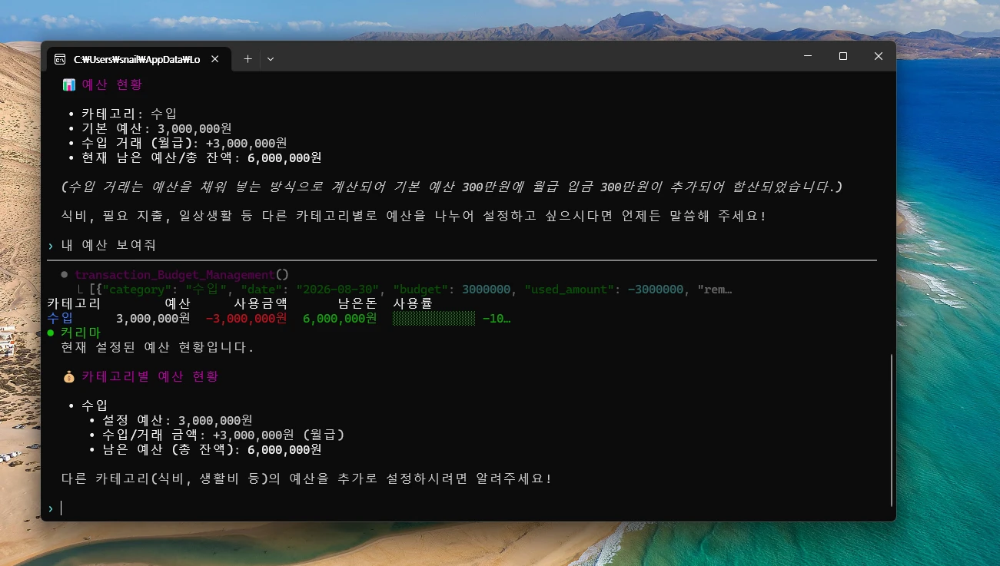
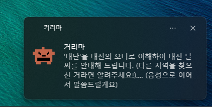
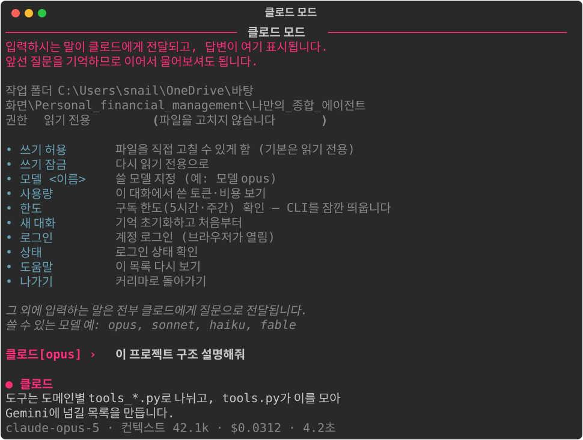

# 커리마 (Kurima)

터미널에서 자연어로 대화하는 개인비서 CLI. 가계부·할일·메모·계산·날씨/환율을 말로 처리하고,
필요하면 클로드나 코덱스를 불러 코딩 작업까지 맡길 수 있습니다. 여러 도구를 정해진 순서로
엮어야 하는 일은 `skills/` 폴더에 마크다운으로 적어두면 그 절차를 따릅니다.

Gemini Function Calling으로 도구를 호출하고, 화면은 [Rich](https://github.com/Textualize/rich)로 그립니다.
구조가 왜 이렇게 됐는지·어떻게 확장돼왔는지는 [ROADMAP.md](ROADMAP.md), 실제 코드가 어떤 순서로
움직이는지는 [ARCHITECTURE.md](ARCHITECTURE.md)에 정리돼 있습니다.



## 할 수 있는 것

말을 걸면 알아서 적절한 도구를 골라 실행합니다.

| 분야 | 예시 |
|---|---|
| **가계부** | "식비 예산 30만원으로 잡아줘" · "오늘 점심 만원 썼어" · "8월 내역 정리해줘" |
| **할일** | "우유 사야 돼 등록해줘" · "완료된 거 정리해줘" |
| **메모** | "발표자료 아이디어 메모해줘, 태그는 아이디어로" |
| **생활 계산기** | "3만원 4명이서 더치페이하면?" · "크리스마스까지 며칠?" |
| **날씨 · 환율** | "서울 날씨 어때?" · "100달러면 원화로 얼마야?" |
| **뉴스 브리핑** | "오늘의 뉴스"(경제 3개 + IT 2개, 헤드라인·주소 표시) → "방금 그 뉴스 요약해줘"로 이어서 요약도 확인 |
| **PC 상태** | "컴퓨터 왜 느린지 확인해줘" (CPU·메모리·디스크·네트워크·상위 프로세스) |
| **클립보드** | "방금 복사한 내용 번역해줘" · "이거 클립보드에 복사해줘" |
| **화면 인식** | "지금 화면 오류가 뭐야?" · "화면에 있는 표 정리해줘" (스크린샷을 직접 보고 답함) |
| **PC 제어** | "메모장 열어줘" · "디스코드 꺼줘" · "볼륨 30으로 낮춰줘" · "화면 잠가줘" |
| **파일 관리** | "지난주에 만든 pdf 찾아줘" · "그 파일 요약해줘" · "바탕화면으로 옮겨줘" · "그 파일 지워줘" |
| **메일 · 일정** | "오늘 중요한 메일하고 일정 정리해줘" (Gmail은 읽기 전용, 구글 캘린더는 조회뿐 아니라 "내일 3시에 회의 일정 잡아줘"처럼 일정 추가도 가능) |
| **자동 브리핑** | "아침 브리핑 8시로 바꿔줘" (실제 알림은 트레이 앱이 보냄, 아래 참고) |
| **선제적 제안** | "회의 알림 15분 전으로 바꿔줘" — 캘린더 일정이 곧 시작하면 먼저 알려줌 (트레이 앱 필요) |
| **음성 웨이크워드** | "커리마"라고 부르고 말하면 답을 음성으로 (트레이 앱 필요, 아래 참고) |
| **로컬 문서 검색** | "내 자료 색인해줘" 한 번 → "예전에 정리한 K-means 자료 찾아줘" (파일 이름이 아니라 내용 기반) |
| **스킬** | "이번 달 정리해줘" · "오늘 뭐 있어?" · "내일 회의 준비해줘" — `skills/`에 적어둔 절차를 따라 여러 도구를 순서대로 엮어 실행 |
| **되돌리기** | "방금 그거 취소해줘" (가계부·할일·메모·파일 이동/이름변경·캘린더 일정 추가 전부) |

### 가계부

예산 대비 사용률을 막대로 보여주고, 초과한 카테고리는 경고합니다.



### 할일 — 구글 할일 연동

여기서 등록/완료/삭제한 항목이 **폰의 구글 할일 앱에도 바로 반영**됩니다.


### PC 제어 · 파일 관리 — 위험한 동작은 먼저 확인받습니다

앱을 강제로 끄거나, 파일을 옮기고, 이름을 바꾸고, 지우거나, 캘린더에 일정을 추가하는
것처럼 되돌리기 어려운 동작은 실행 전에 먼저 확인받습니다. 터미널 대화 중이면
`진행할까요? (y/N)`로, 트레이 앱의 음성 웨이크워드 중이면 "진행할까요?"라고 되물은 뒤
삐 소리 후 "네"라고 답해야 실행됩니다. 그냥 앱을 켜거나 파일을 검색·열기·복사하는 것처럼
안전한 동작은 바로 실행됩니다. 파일 삭제는 완전히 지우지 않고 휴지통으로 보내서, 확인을
거쳤더라도 한 번 더 복구할 여지를 남깁니다.

### 로컬 문서 검색 — 내 자료를 내용으로 찾기 (선택)

"내 자료 색인해줘"라고 한 번 말하면, 문서·바탕화면 폴더의 `.txt`/`.md`/`.pdf`/`.docx` 파일을
훑어서 내용을 Gemini 임베딩으로 벡터화해 저장해둡니다(`data/local_index.json`). 그다음부터
"예전에 정리한 K-means 자료 찾아줘"처럼 **파일 이름이 아니라 내용을 이해해서** 찾아줍니다.

- **색인은 자동으로 갱신되지 않습니다.** 파일을 추가하거나 고쳤으면 "다시 색인해줘"라고
  한 번 더 말해야 하는데, 이때도 안 바뀐 파일은 건너뛰어서 처음보다 훨씬 빠릅니다.
- **이건 커리마의 다른 기능들과 달리 Gemini API 호출이 늘어납니다.** 색인할 때 문서 조각 수만큼,
  검색할 때 질문 1건당 임베딩 API가 한 번씩 호출됩니다. 다른 기능들(뉴스·날씨·환율·PC
  제어 등)은 전부 무료지만, 이 기능은 Gemini 사용량에 포함됩니다.

### 스킬 — 마크다운 파일로 절차를 가르치기

여러 도구를 정해진 순서로 엮어야 하는 일(예: 월말 가계부 마감)은 그때그때 설명하기 번거롭습니다.
`skills/<이름>/SKILL.md` 파일에 절차를 적어두면 커리마가 관련된 요청에서 그 절차를 따릅니다.

```
skills/monthly-closing/SKILL.md
```

```markdown
---
name: monthly-closing
description: 한 달 가계부를 마감 정리한다. "이번 달 정리해줘", "월말 결산"...
---

1. 대상 월을 정한다 (말 안 하면 이번 달)
2. `transaction_Budget_Management`로 예산 대비 현황을 먼저 본다
3. `monthly_Transaction_History`로 월간 리포트를 만든다
...
```

**시스템 지시문에는 `description` 한 줄만 올라갑니다.** 본문은 커리마가 "이 요청은 이 스킬과
관련 있다"고 판단했을 때 `read_skill` 도구로 직접 읽어갑니다. 그래서 스킬을 아무리 많이 늘려도
관련 없는 대화에서는 토큰을 쓰지 않습니다. 현재 기본 스킬 5개 기준으로, 시스템 지시문에 실리는
건 578자인데 실제 절차 본문은 5,512자입니다 — 90%가 필요할 때만 실립니다.

**폴더만 추가하면 되고 코드는 안 고쳐도 됩니다.** 설치해서 쓰는 경우에도 설치 폴더의 `skills/`에
`SKILL.md`를 넣으면 그대로 인식됩니다. 커리마를 켜둔 채 파일을 고쳐도 다음 요청부터 반영됩니다.

기본으로 5개가 들어 있습니다.

| 스킬 | 하는 일 |
| --- | --- |
| `monthly-closing` | 월말 가계부 마감 — 예산 대비 확인 → 리포트 생성 → 초과 원인 분석 → 보고 |
| `morning-brief` | 오늘 하루 정리 — 일정·메일·할일을 모아 우선순위대로, "지금 뭐부터"까지 |
| `meeting-prep` | 회의 준비 — 일정 특정 → 관련 메일·메모 수집 → 챙길 것 체크리스트 → 할일 등록 |
| `local-search` | 로컬 문서 검색 — 색인이 없으면 시간·비용을 먼저 안내하고 진행 |
| `briefing-setup` | 아침 브리핑 설정 — 트레이 앱이 켜져 있어야 알림이 온다는 것까지 안내 |

### 트레이 앱 — 자동 브리핑 · 다운로드 알림 (선택)

`app.py`는 터미널을 열어야만 도는 대화형 CLI라서, "매일 아침 9시에" 같은 건 이 안에서는 못
합니다. 이걸 하려면 컴퓨터가 켜져 있는 동안 계속 떠 있는 별도 프로세스가 필요해서
`tray_app.py`를 따로 만들었습니다.

```bash
cd 나만의_종합_에이전트
python tray_app.py
```

실행하면 시스템 트레이(작업 표시줄 우측 하단)에 마스코트 아이콘이 뜨고, 그때부터 네 가지를 백그라운드에서 합니다.


응답을 기다리는 동안 "생각 중..." 알림이 먼저 뜨고, 잠시 뒤 답이 담긴 알림으로 바뀝니다(둘 다
마스코트 아이콘 + 효과음).

　

- **자동 아침 브리핑**: 설정된 시각(기본 오전 9시)에 오늘의 뉴스를 윈도우 알림으로 보냅니다.
  시각은 `app.py`에서 "아침 브리핑 8시로 바꿔줘"처럼 자연어로 바꿀 수 있고, "꺼줘"라고 하면 끌 수 있습니다.
- **다운로드 완료 알림**: 다운로드 폴더에 새 파일이 생기면(다운로드 도중 임시 파일은 무시하고
  완료된 것만) 알림을 보냅니다.
- **음성 웨이크워드**: "커리마"라고 부르면 삐 소리가 나고 이어서 하는 말을 듣습니다(말을
  마치고 잠깐 조용해지면 그 자리에서 바로 인식을 시작해서, 짧게 말할수록 반응도 빨라집니다).
  대화형 모드처럼 도구를 호출해 답하고, 답은 알림(마스코트 아이콘 + 효과음) + 음성(한국어
  TTS)으로 옵니다. 앱을 강제로 끄거나 파일을 지우는 것처럼 확인이 필요한 동작은 "진행할까요?"
  라고 음성으로 되물은 뒤 삐 소리 후 "네"라고 답해야 실행되고, 애매하거나 답이 없으면 안전하게
  취소됩니다. 트레이 아이콘을 우클릭하면 켜고 끌 수 있습니다.
- **선제적 제안(일정 알림)**: 구글 캘린더 일정이 설정된 시간(기본 10분) 전이 되면 먼저
  알려줍니다. "회의 알림 15분 전으로 바꿔줘"/"일정 알림 꺼줘"처럼 자연어로 바꿀 수 있고,
  같은 일정을 두 번 알리지 않습니다. 캘린더 연동이 안 돼 있으면 조용히 건너뛰고 다음 주기에
  다시 시도합니다.

**음성 웨이크워드는 왜 "Hey Jarvis" 같은 방식이 아닌지**: openWakeWord 같은 무료 전용
웨이크워드 엔진은 미리 학습된 영어 단어(Hey Jarvis 등)만 지원하고, Vosk 같은 전통 방식
한국어 인식기는 정해진 단어 사전 안에서만 인식해서 "커리마"처럼 사전에 없는 이름은 아예
인식이 안 됩니다. 그래서 신경망 기반 오프라인 인식기인 **faster-whisper**로 짧은 구간을
계속 녹음·인식하면서 "커리마"와 발음이 비슷한지 직접 비교하는 방식을 씁니다 — 전용 엔진보다
**CPU를 더 쓰지만**, 원하는 이름을 그대로 쓸 수 있습니다. 첫 실행 시 필요한 모델을
자동으로 내려받습니다(인터넷 필요, 이후엔 오프라인 동작).

트레이 아이콘은 마스코트 그림 그대로이고, 우클릭하면 **"커리마 열기"**(새 창에서 대화형
CLI 실행)와 **"종료"**가 있습니다. 컴퓨터를 켤 때마다 자동으로 뜨게 하고 싶다면, `tray_app.py`의
바로가기를 `shell:startup` 폴더에 넣으면 됩니다(윈도우 시작 프로그램 등록은 사용자가 직접
하는 설정이라 스크립트가 알아서 하지 않습니다) — 설치 파일로 설치했다면 설치 중에 자동 시작
체크박스로 대신할 수 있습니다.

### 클로드 / 코덱스 모드

PC에 설치된 `claude`, `codex` CLI를 커리마 안에서 부릅니다. 이미 로그인된 구독 계정을
그대로 쓰기 때문에 **API 키를 따로 발급받거나 추가로 과금되지 않습니다.**



- 앞선 질문을 기억해 대화가 이어집니다
- 기본은 **읽기 전용**입니다. `쓰기 허용`을 입력해야 파일을 고칠 수 있고, 그동안은 프롬프트가 노란색으로 바뀝니다
- `모델 opus`처럼 모델을 지정할 수 있습니다
- `사용량`으로 이 대화에서 쓴 토큰·비용을 봅니다 (클로드만 지원)

## 설치

### 설치 파일로 설치하기 (Windows, 권장)

Python을 따로 설치하지 않아도 됩니다.
[여기서 `KurimaSetup.exe` 받기](https://github.com/snail5039-code/personal-financial-management/releases/latest)
— 실행하면 관리자 권한 없이 `%LOCALAPPDATA%\Programs\Kurima`에 설치되고, 시작 메뉴/바탕화면에
아이콘이 생깁니다(자동 시작 체크박스로 Windows 시작 시 트레이 앱을 바로 띄울 수도 있음).

설치 후 처음 실행하면 Gemini API 키를 입력하라고 직접 물어봅니다 — 무료 발급 링크는
[Google AI Studio](https://aistudio.google.com/apikey)이고, 한 번 입력하면 다음부터는 다시
안 물어봅니다. 구글 할일/Gmail/캘린더까지 쓰려면 아래 "구글 할일 연동" 절 안내대로 받은
`credentials.json`을 설치된 폴더(`%LOCALAPPDATA%\Programs\Kurima`)에 넣어주세요.

### 소스로 직접 실행하기 (개발용, Windows/macOS/Linux)

Python 3.10 이상이 필요합니다.

```bash
git clone https://github.com/snail5039-code/personal-financial-management.git
```

```bash
pip install -r 나만의_종합_에이전트/requirements.txt
```

```bash
cd 나만의_종합_에이전트
```

```bash
python app.py
```

처음 실행하면 Gemini API 키를 물어보고 `.env`에 저장합니다(무료 발급:
[Google AI Studio](https://aistudio.google.com/apikey)) — `.env` 파일을 직접 만들 필요는 없습니다.

### 직접 실행 파일(.exe) 만들기 (선택)

설치 파일을 직접 빌드하고 싶다면(레포에는 용량 때문에 실행 파일 자체는 없고 소스만 있음):

```bash
pip install pyinstaller
cd 나만의_종합_에이전트
pyinstaller kurima.spec
```

`dist/Kurima/`에 `Kurima.exe`(대화형 CLI)와 `KurimaTray.exe`(트레이 앱)가 만들어집니다.
여기에 설치 마법사까지 씌우려면 [Inno Setup](https://jrsoftware.org/isinfo.php)을 설치한 뒤
같은 폴더의 `kurima_setup.iss`를 컴파일하면 `installer_output/KurimaSetup.exe`가 나옵니다.

### 구글 할일 연동 (선택)

할일 기능을 쓰려면 구글 인증이 필요합니다. 무료이고, 안 해도 나머지 기능은 정상 동작합니다.

1. [Google Cloud Console](https://console.cloud.google.com)에서 프로젝트 생성
2. **API 및 서비스 → 라이브러리**에서 `Google Tasks API` 사용 설정
3. **OAuth 동의 화면**을 외부(External)로 만들고, **테스트 사용자에 본인 이메일 추가**
4. **사용자 인증 정보 → OAuth 클라이언트 ID → 데스크톱 앱**을 만들어 JSON 다운로드
5. 받은 파일을 `나만의_종합_에이전트/credentials.json`으로 저장

처음 할일 기능을 쓸 때 브라우저가 열리고, 한 번 로그인하면 이후 자동으로 연동됩니다.

### Gmail · 구글 캘린더 연동 (선택)

Gmail은 읽기 전용입니다(메일 발송/삭제는 지원하지 않음). 구글 캘린더는 조회뿐 아니라 일정
추가도 지원하고(수정/삭제는 아직 안 됨), 일정을 실제로 추가하기 전에는 항상 확인을 먼저
받습니다. 위에서 만든 것과 **같은 Google Cloud 프로젝트, 같은 `credentials.json`을 그대로
재사용**하고, 필요한 API만 추가로 켜면 됩니다.

1. 같은 프로젝트의 **API 및 서비스 → 라이브러리**에서 `Gmail API`, `Google Calendar API`를 각각 사용 설정
2. **OAuth 동의 화면**의 테스트 사용자에 본인 이메일이 이미 등록돼 있으면 추가 작업 없음
3. `credentials.json`은 이미 있으니 새로 받을 필요 없음

메일/일정 기능을 각각 처음 쓸 때 브라우저가 따로 한 번씩 열립니다 (권한을 도메인별로 분리해서
따로 저장하기 때문). 앱이 아직 게시(Publish) 전 테스트 상태라 "확인되지 않은 앱" 경고가 뜰 수 있는데,
본인이 만든 개인용 앱이니 **고급(Advanced) → (앱 이름)으로 이동(안전하지 않음)**을 눌러 진행하면 됩니다.

### 클로드 / 코덱스 모드 (선택)

각 CLI가 설치돼 있어야 합니다. 모드 안에서 `로그인`을 입력하면 바로 로그인할 수 있습니다.

## 구조

```
나만의_종합_에이전트/
├─ app.py            대화 루프와 터미널 화면 (Rich)
├─ agent_cli.py      클로드/코덱스 CLI 호출
├─ tray_app.py       트레이 앱 — 자동 브리핑 · 다운로드 알림 · 음성 웨이크워드 (app.py와 별도 프로세스)
├─ voice_assistant.py 음성 웨이크워드 인식 (faster-whisper), tray_app.py가 씀
│
├─ tools/            Gemini에 넘길 도구 계층 (함수 + 스키마)
│  ├─ __init__.py       도구 모음 — 도메인 모듈을 모아 Gemini에 넘길 목록 생성 (REGISTRY)
│  ├─ tools_budget.py   거래 · 예산 · 카테고리
│  ├─ tools_todo.py     할일 (구글 할일)
│  ├─ tools_memo.py     메모
│  ├─ tools_calc.py     생활 계산기
│  ├─ tools_info.py     날씨 · 환율
│  ├─ tools_news.py     경제 · IT 뉴스
│  ├─ tools_system.py   PC 상태 (CPU·메모리·디스크·네트워크)
│  ├─ tools_clipboard.py 클립보드
│  ├─ tools_screen.py   화면 인식 (스크린샷 + Gemini vision)
│  ├─ tools_pc.py       PC 제어 (앱 실행/종료, 볼륨, 화면 잠금)
│  ├─ tools_file.py     파일 관리 (검색/열기/읽기/복사/이동/이름변경/삭제)
│  ├─ tools_gmail.py    Gmail (읽기 전용)
│  ├─ tools_calendar.py 구글 캘린더 (조회 + 일정 추가)
│  ├─ tools_schedule.py 자동 아침 브리핑 시각 설정
│  ├─ tools_local.py    로컬 문서 의미 기반 검색 (RAG)
│  ├─ tools_skill.py    스킬 (skills/ 폴더의 SKILL.md 절차를 필요할 때만 읽어옴)
│  │
│  ├─ storage.py        거래 내역 저장 (data/transactions.json)
│  ├─ memo_storage.py   메모 저장 (data/memos.json)
│  ├─ undo.py           되돌리기 공용 저장소
│  ├─ local_index.py    문서 색인·임베딩·유사도 검색 로직, tools_local.py가 씀
│  ├─ calculator.py     계산 로직
│  ├─ weather.py        날씨 조회 (wttr.in)
│  ├─ exchange.py       환율 조회 (Frankfurter)
│  └─ news.py           뉴스 조회 (연합뉴스 · 전자신문 RSS)
│
├─ skills/           스킬 — 여러 도구를 엮는 절차를 적은 마크다운 (폴더만 추가하면 늘어남)
│  ├─ monthly-closing/SKILL.md   월말 가계부 마감 정리
│  ├─ morning-brief/SKILL.md     오늘 하루 브리핑 (일정·메일·할일)
│  ├─ meeting-prep/SKILL.md      회의·약속 준비
│  ├─ local-search/SKILL.md      로컬 문서 검색 (색인 먼저 안내)
│  └─ briefing-setup/SKILL.md    아침 브리핑 설정
│
├─ google_api/       구글 API 호출 계층 (스키마 없음 — tools/·tray_app.py가 갖다 씀)
│  ├─ google_auth.py    구글 API 공용 인증 헬퍼 (서비스별 토큰 분리)
│  ├─ google_tasks.py   구글 할일 API
│  ├─ google_gmail.py   Gmail API
│  └─ google_calendar.py 구글 캘린더 API
│
├─ kurima.spec       PyInstaller 빌드 설정 (Kurima.exe/KurimaTray.exe)
├─ kurima_setup.iss  Inno Setup 설치 파일 빌드 설정
└─ kurima.ico        마스코트 아이콘 (exe/설치 파일/트레이 아이콘에 공통 사용)
```

코드는 두 계층으로 나뉩니다. `google_api/`는 구글 서버에 실제로 요청을 보내는 부품이고,
`tools/`는 그 부품을 Gemini가 호출할 수 있게 스키마(`<함수명>_tool`)와 함께 포장한 도구입니다.
그래서 `google_api/`에는 스키마가 없고, Gemini를 거치지 않는 `tray_app.py`의 백그라운드 루프는
`google_api/`를 직접 호출합니다.

도구를 추가하려면 알맞은 `tools/tools_*.py`에 구현 함수와 스키마를 넣고,
`tools/__init__.py`의 `REGISTRY`에 이름을 등록하면 됩니다. 새 도구가 되돌리기 어려운
동작(삭제·강제종료 등)이면 `tools/__init__.py`의 `CONFIRM_MESSAGES`에 등록해서 `app.py`가
실행 전에 자동으로 y/n 확인을 받게 할 수 있습니다.

되돌리기는 `tools/undo.py`가 "되돌리는 방법"을 함수로 기억하는 방식이라, 새 도메인을 추가해도
`undo.record(...)`만 호출하면 자동으로 지원됩니다.

**스킬을 추가하려면** `skills/<이름>/SKILL.md` 파일 하나만 만들면 됩니다(`REGISTRY` 등록 불필요).
도구는 "커리마가 무엇을 할 수 있는지"를 늘리고, 스킬은 "이미 있는 도구를 어떤 순서로 쓰는지"를
가르칩니다. 그래서 새 기능이 필요하면 도구를, 절차나 판단 기준을 정해주고 싶으면 스킬을 씁니다.
`skills/` 폴더가 없거나 비어 있으면 스킬 기능만 조용히 꺼지고 나머지는 그대로 동작합니다.

## 알아두면 좋은 것

- **데이터는 전부 로컬**에 저장됩니다 (`data/` 폴더, git에서 제외). 구글 할일·Gmail·캘린더만 예외로 클라우드에 있는 걸 그대로 읽습니다.
- **Gmail은 읽기 전용**입니다(메일 발송/삭제는 지원하지 않음). **구글 캘린더는 조회와 일정 추가**를
  지원하고(수정/삭제는 아직 안 됨), 일정 추가는 실행 전에 항상 확인을 받습니다. 권한 토큰은 할일과
  따로 저장돼서(`data/google_gmail_token.json`, `data/google_calendar_token.json`) 서로 영향을 안 줍니다.
- **되돌리기는 한 단계**만 지원합니다.
- 삭제한 할일을 되돌리면 내용은 같지만 **id는 새로 부여**됩니다. 구글 API가 완전한 복구를 지원하지 않습니다.
- **구독 한도(5시간·주간)는 CLI로 조회할 수 없습니다.** 모드 안에서 `한도`를 입력하면 CLI를 잠깐 띄워 확인할 수 있습니다.
- 창을 좁히면 예산 표가 자동으로 세로 목록으로 바뀝니다. 다만 **이미 출력된 화면은 터미널이 다시 접기 때문에** 줄이 넘어가 보일 수 있습니다.
- **뉴스 브리핑은 자동으로 뜨지 않고 '오늘의 뉴스'라고 말했을 때만** 보여줍니다. 각 헤드라인에는 실제 기사 주소와
  요약문이 함께 딸려오기 때문에, 이어서 "그 뉴스 요약해줘"처럼 물어보면 다시 조회하지 않고 바로 답합니다.
  정해진 시각에 컴퓨터가 꺼져 있어도 알림을 받고 싶다면 OS 스케줄러(Windows 작업 스케줄러 등) 등록이 별도로 필요합니다.
- **화면 인식은 화면을 캡처해서 Gemini에게 그대로 보냅니다.** 캡처한 이미지는 `data/screenshots/`에 저장되고
  (로컬에만, git에서 제외) 별도로 지워지지 않으니 민감한 화면을 자주 캡처했다면 가끔 비워주는 게 좋습니다.

## 라이선스

개인 학습용 프로젝트입니다.
