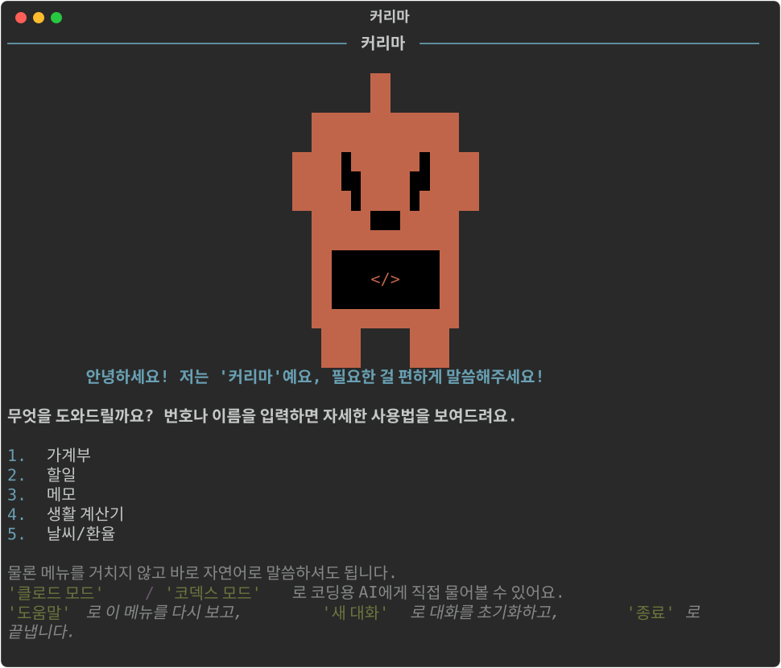
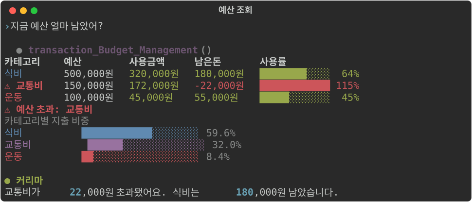

# 커리마 (Kurima)

터미널에서 자연어로 대화하는 개인비서 CLI. 가계부·할일·메모·계산·날씨/환율을 말로 처리하고,
필요하면 클로드나 코덱스를 불러 코딩 작업까지 맡길 수 있습니다.

Gemini Function Calling으로 도구를 호출하고, 화면은 [Rich](https://github.com/Textualize/rich)로 그립니다.



## 할 수 있는 것

말을 걸면 알아서 적절한 도구를 골라 실행합니다.

| 분야 | 예시 |
|---|---|
| **가계부** | "식비 예산 30만원으로 잡아줘" · "오늘 점심 만원 썼어" · "8월 내역 정리해줘" |
| **할일** | "우유 사야 돼 등록해줘" · "완료된 거 정리해줘" |
| **메모** | "발표자료 아이디어 메모해줘, 태그는 아이디어로" |
| **생활 계산기** | "3만원 4명이서 더치페이하면?" · "크리스마스까지 며칠?" |
| **날씨 · 환율** | "서울 날씨 어때?" · "100달러면 원화로 얼마야?" |
| **되돌리기** | "방금 그거 취소해줘" (가계부·할일·메모 전부) |

### 가계부

예산 대비 사용률을 막대로 보여주고, 초과한 카테고리는 경고합니다.



### 할일 — 구글 할일 연동

여기서 등록/완료/삭제한 항목이 **폰의 구글 할일 앱에도 바로 반영**됩니다.


### 클로드 / 코덱스 모드

PC에 설치된 `claude`, `codex` CLI를 커리마 안에서 부릅니다. 이미 로그인된 구독 계정을
그대로 쓰기 때문에 **API 키를 따로 발급받거나 추가로 과금되지 않습니다.**


- 앞선 질문을 기억해 대화가 이어집니다
- 기본은 **읽기 전용**입니다. `쓰기 허용`을 입력해야 파일을 고칠 수 있고, 그동안은 프롬프트가 노란색으로 바뀝니다
- `모델 opus`처럼 모델을 지정할 수 있습니다
- `사용량`으로 이 대화에서 쓴 토큰·비용을 봅니다 (클로드만 지원)

## 설치

Python 3.10 이상이 필요합니다.

```bash
git clone https://github.com/snail5039-code/personal-financial-management.git
```

```bash
pip install -r 나만의_종합_에이전트/requirements.txt
```

`나만의_종합_에이전트/.env` 파일을 만들고 Gemini API 키를 넣습니다.
키는 [Google AI Studio](https://aistudio.google.com/apikey)에서 무료로 발급받습니다.

```
GEMINI_API_KEY=발급받은_키
```

```bash
cd 나만의_종합_에이전트
```

```bash
python app.py
```

### 구글 할일 연동 (선택)

할일 기능을 쓰려면 구글 인증이 필요합니다. 무료이고, 안 해도 나머지 기능은 정상 동작합니다.

1. [Google Cloud Console](https://console.cloud.google.com)에서 프로젝트 생성
2. **API 및 서비스 → 라이브러리**에서 `Google Tasks API` 사용 설정
3. **OAuth 동의 화면**을 외부(External)로 만들고, **테스트 사용자에 본인 이메일 추가**
4. **사용자 인증 정보 → OAuth 클라이언트 ID → 데스크톱 앱**을 만들어 JSON 다운로드
5. 받은 파일을 `나만의_종합_에이전트/credentials.json`으로 저장

처음 할일 기능을 쓸 때 브라우저가 열리고, 한 번 로그인하면 이후 자동으로 연동됩니다.

### 클로드 / 코덱스 모드 (선택)

각 CLI가 설치돼 있어야 합니다. 모드 안에서 `로그인`을 입력하면 바로 로그인할 수 있습니다.

## 구조

```
나만의_종합_에이전트/
├─ app.py            대화 루프와 터미널 화면 (Rich)
├─ agent_cli.py      클로드/코덱스 CLI 호출
├─ tools.py          도구 모음 — 도메인 모듈을 모아 Gemini에 넘길 목록 생성
│  ├─ tools_budget.py   거래 · 예산 · 카테고리
│  ├─ tools_todo.py     할일 (구글 할일)
│  ├─ tools_memo.py     메모
│  ├─ tools_calc.py     생활 계산기
│  └─ tools_info.py     날씨 · 환율
├─ undo.py           되돌리기 공용 저장소
├─ storage.py        거래 내역 저장 (data/transactions.json)
├─ memo_storage.py   메모 저장 (data/memos.json)
├─ google_tasks.py   구글 할일 API
├─ calculator.py     계산 로직
├─ weather.py        날씨 조회 (wttr.in)
└─ exchange.py       환율 조회 (Frankfurter)
```

도구를 추가하려면 알맞은 `tools_*.py`에 구현 함수와 스키마를 넣고, `tools.py`의 `REGISTRY`에
이름을 등록하면 됩니다.

되돌리기는 `undo.py`가 "되돌리는 방법"을 함수로 기억하는 방식이라, 새 도메인을 추가해도
`undo.record(...)`만 호출하면 자동으로 지원됩니다.

## 알아두면 좋은 것

- **데이터는 전부 로컬**에 저장됩니다 (`data/` 폴더, git에서 제외). 구글 할일만 예외로 클라우드에 올라갑니다.
- **되돌리기는 한 단계**만 지원합니다.
- 삭제한 할일을 되돌리면 내용은 같지만 **id는 새로 부여**됩니다. 구글 API가 완전한 복구를 지원하지 않습니다.
- **구독 한도(5시간·주간)는 CLI로 조회할 수 없습니다.** 모드 안에서 `한도`를 입력하면 CLI를 잠깐 띄워 확인할 수 있습니다.
- 창을 좁히면 예산 표가 자동으로 세로 목록으로 바뀝니다. 다만 **이미 출력된 화면은 터미널이 다시 접기 때문에** 줄이 넘어가 보일 수 있습니다.

## 라이선스

개인 학습용 프로젝트입니다.
